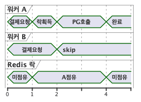
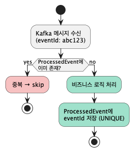

# 💸 Event-Driven Payment System 💸

Kafka를 활용한 **이벤트 기반 비동기 결제 시스템**입니다.

메시지 유실 방지, 동시성 제어 및 멱등성 보장, 장애 복구를 중심으로 설계했습니다.

## 🛠 기술 스택
- Java 21, Spring Boot 4.0, Spring Data JPA
- Apache Kafka, Debezium CDC
- MySQL, Redis
- WireMock (PG Mock), JUnit5

## ✨ 주요 구현 내역

- **비동기 결제 파이프라인** — Kafka 기반으로 주문 ~ 결제 ~ 후처리를 이벤트로 연결
- **트랜잭션 경계 분리** — PG 호출을 트랜잭션 밖으로 분리해 DB 커넥션 점유와 락 확산 방지, 실패 범위 격리
- **Outbox + CDC** — DB 커밋과 Kafka 발행을 원자적으로 처리해 메시지 유실 방지
- **동시성 제어 및 멱등성 보장** — Redis 분산락, 완료 이벤트 추적 테이블로 레이어별 중복 방지
- **Retry / DLQ** — PG 실패 유형에 따른 재시도 전략, DLQ 실패 감지(Slack 알람) 및 이력 저장 체계

 

## 📊 ERD

### 인덱스 설계
| 테이블 | 인덱스 | 목적                   |
|--------|--------|----------------------|
| orders | (user_id, created_at) | 유저별 최신 주문 목록 조회      |
| payment_dlq_log | (payment_id, reprocess_status) | 재처리 대상 조회            |
| outbox_event | event_id UNIQUE | 중복 발행 방지             |
| processed_event | event_id UNIQUE | 컨슈머 멱등성 보장           |
| payment_dlq_log | event_id UNIQUE | DLQ 중복 적재 방지         |

 

## 🧭 결제 처리 흐름

### 🔀 트랜잭션 경계 분리 
단계 | 트랜잭션 | 내용                          
--- | --- |-----------------------------
TX1 | O | 재고 차감, 주문/결제, Outbox 저장
PG 호출 | **X** | 트랜잭션 없이 수행
TX2 | O | 결제 결과 확정, Outbox 저장
TX3 | O | 주문 상태 업데이트, 장바구니 삭제 / 재고 롤백

> PG 호출을 트랜잭션 밖으로 분리해 DB 커넥션 점유와 락 확산 방지
> 
> 결제 확정(TX2)과 후처리(TX3)를 분리해 후처리 실패 시 독립적으로 재처리가 가능합니다.

 

### 📬 Outbox, CDC
- TX1, TX2에서 Outbox 테이블에 메시지를 저장하면 Debezium CDC가 DB 변경을 감지해 Kafka에 발행합니다. 
- DB 커밋과 Kafka 발행이 원자적으로 처리되어 메시지 유실을 방지합니다.

 

## 🔒 동시성 제어 및 멱등성 보장

### 🔐 Redis 분산락 — 결제 선점 및 DLQ 재처리 선점

- **중복 결제**나 **DLQ 재처리 엔드포인트 중복 호출**을 방지합니다.
- `@DistributedLock` 어노테이션과 AOP로 구현해 락 로직을 비즈니스 코드와 분리했습니다. 
- 동시성 제어는 Redis가 담당하고 DB는 데이터 저장에만 집중합니다.

### 🔁 ProcessedEvent 테이블 — 컨슈머 멱등성

- 처리 완료된 eventId를 저장하고, 메시지 수신 시 중복 여부를 체크해 **같은 메시지가 두 번 처리되는 것을 방지**합니다.
- eventId에 UNIQUE 제약이 걸려 있어 동시에 진입해도 하나만 커밋됩니다.
- DLQ 재처리 시에도 동일하게 적용되어 안전하게 재처리할 수 있습니다.

 

## 🚨 DLQ
