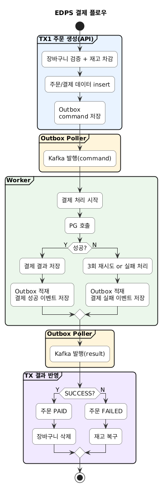
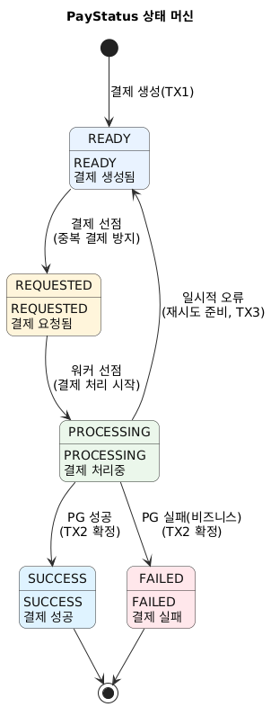
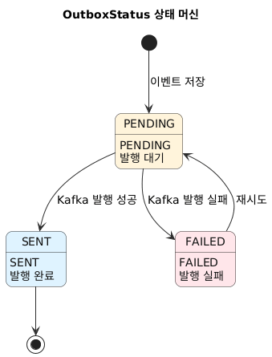

# 💸 Event-Driven Payment System 💸

Kafka와 Outbox 패턴을 활용한 **이벤트 기반 비동기 결제 시스템**입니다.   
결제 요청 → 처리 → 결과 반영 전 과정을 **정합성, 멱등성, 장애 복원성**을 중심으로 설계했습니다.

<br>

## 🛠 기술 스택

- Java 21, Spring Boot 4.0
- Apache Kafka, Spring Data JPA
- MySQL, Redis, WireMock (PG Mock)

<br>

## ✨ 주요 구현 내역

- Kafka 기반 **비동기 결제 파이프라인**
- Outbox 패턴으로 **DB 트랜잭션과 메시지 발행 정합성 보장**
- 상태머신 + Claim 기반 **중복 결제 방지**
- `ProcessedEvent` 기반 **컨슈머 멱등성 보장** (결제 요청/결과 양쪽)
- 결제 단계를 **트랜잭션 경계별로 분리**
- 재시도 / 타임아웃 / Stuck 결제 복구 로직 구현
- Redis 기반 **장바구니 캐시**

<br>

## 🧭 결제 처리 흐름



<br>

## 🔁 상태 머신


<br>



<br>

## 🔐 Claim 기반 선점 (결제 워커 / Outbox Poller)

**중복 처리 방지를 위해 두 곳에서 동일한 CAS(Compare-And-Swap) 패턴을 사용합니다.**

### 결제 워커 선점
동일 Payment ID에 대해 단 하나의 워커만 PG 호출을 수행하도록 선점합니다.

```sql
UPDATE payment SET status = 'PROCESSING'
WHERE id = ? AND status = 'REQUESTED'
```

### Outbox Poller 선점
여러 인스턴스가 동시에 폴링하더라도 동일 이벤트가 중복 발행되지 않도록 선점합니다.

```sql
UPDATE outbox_event SET status = 'PROCESSING'
WHERE id = ? AND status = 'PENDING'
```

UPDATE 결과가 0이면 다른 인스턴스가 이미 선점한 것으로 판단해 건너뜁니다.
DB의 단일 원자적 연산으로 애플리케이션 레벨 락 없이 선점을 보장합니다.

<br>

## 🔑 컨슈머 멱등성

Kafka 재시도·리밸런싱 시 동일 메시지가 재처리되는 것을 방지합니다.

**`ProcessedEvent` 테이블** (eventId UNIQUE)을 공유 저장소로 사용합니다.

| 컨슈머 | 적용 위치 | 동작 |
|--------|-----------|------|
| 결제 요청 워커 | `PaymentTxService.confirm()` | 결과 확정 트랜잭션 내 ProcessedEvent 저장 |
| 결제 결과 컨슈머 | `PaymentResultTxService.applySuccess/applyFailure()` | 처리 전 `existsByEventId` 확인 후 skip 또는 저장 |

동일 eventId가 동시에 진입해도 UNIQUE 제약으로 하나만 커밋됩니다.

<br>

## 🧱 Transaction Boundary 분리

 단계	                 | 트랜잭션 
---------------------|------
 주문 생성 / 결제 생성	      | TX1  
 결제 선점(claim)	       | TX2  
 PG 호출	              | 없음   
 결과 확정 + 로그 + Outbox | 	TX3 
 결과 반영(Order)	       | TX4  

> PG는 트랜잭션 밖에서 호출하여 DB Lock 확산과 장기 트랜잭션을 방지합니다.

<br>

## 🔄 Retry / Timeout / Recovery 전략
- Kafka `DefaultErrorHandler` 기반 재시도 
- transient 오류 시 `PROCESSING → READY` 되돌려 재시도 유도 
- 일정 시간 이상 PROCESSING 상태 유지 시
  - → `PaymentStuckRecoveryJob`이 100건씩 페이징 조회
  - → 주문 단위로 `REQUIRES_NEW` 독립 트랜잭션 처리 (1건 실패가 나머지에 영향 없음)
  - → stuck 결제 FAILED 확정 + 재고 롤백 + 실패 이벤트 발행

<br>

## 🧠 설계 의도
- DB 트랜잭션과 메시지 발행을 분리하면 유실 위험 → **Outbox 패턴 도입**
- 워커 수 증가 시 중복 처리 위험 → **Claim(조건부 업데이트) 방식**
- 긴 PG 호출로 DB Lock 확산 위험 → **트랜잭션 외부 호출**