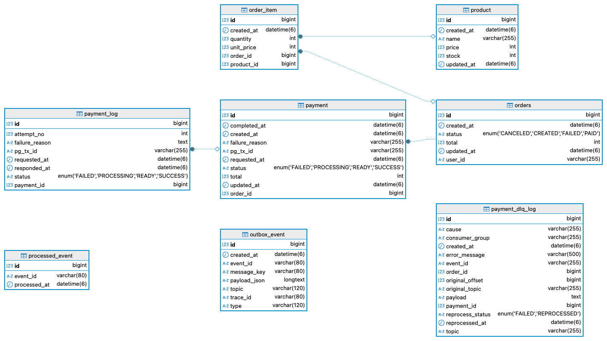
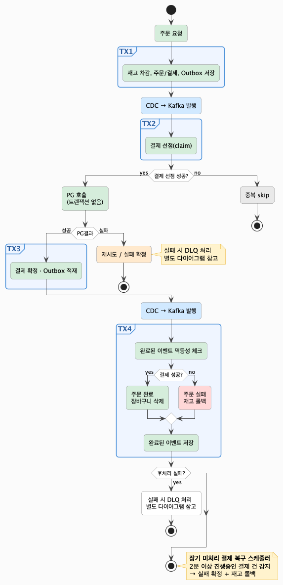
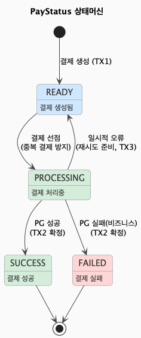
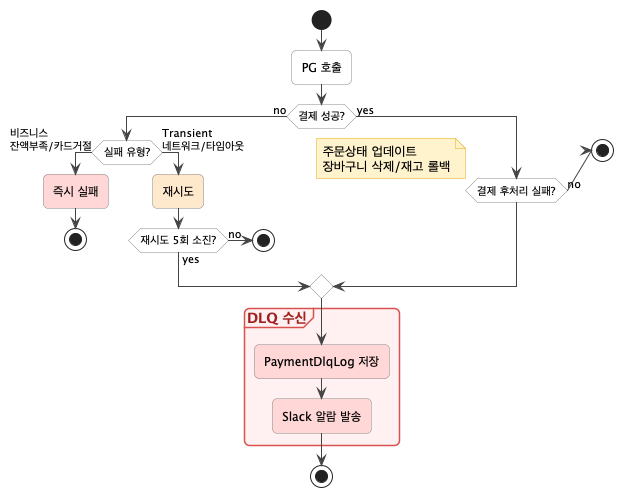

# 💸 Event-Driven Payment System 💸

Kafka를 활용한 **이벤트 기반 비동기 결제 시스템**입니다.

메시지 유실 방지, 동시성 제어 및 멱등성 보장, 장애 복구를 중심으로 설계했습니다.


## 🛠 기술 스택
- Java 21, Spring Boot 4.0, Spring Data JPA
- Apache Kafka, Debezium CDC
- MySQL, Redis
- WireMock (PG Mock), JUnit5


## ✨ 주요 구현 내역

- **비동기 결제 파이프라인** — Kafka 기반으로 `주문`~`결제`~`후처리`를 이벤트로 연결
- **트랜잭션 경계 분리** — PG 호출을 트랜잭션 밖으로 분리해 DB 커넥션 점유와 락 확산 방지
- **Outbox + CDC** — DB 커밋과 Kafka 발행을 원자적으로 처리해 메시지 유실 방지
- **동시성 제어 및 멱등성 보장** — 조건부 업데이트, Redis 분산락, ProcessedEvent 테이블 등 레이어별 중복 방지
- **DLQ + 재처리 API** — 실패 감지(Slack 알람), 이력 저장, 운영자 수동 재처리까지 완성된 운영 체계

<br>

## 📊 ERD



### 인덱스 설계
| 테이블 | 인덱스 | 목적                   |
|--------|--------|----------------------|
| payment | (status, updated_at) | 장기 미처리 결제 복구 스케줄러 조회 |
| orders | (user_id, created_at) | 유저별 최신 주문 목록 조회      |
| payment_dlq_log | (payment_id, reprocess_status) | 재처리 대상 조회            |
| outbox_event | event_id UNIQUE | 중복 발행 방지             |
| processed_event | event_id UNIQUE | 컨슈머 멱등성 보장           |
| payment_dlq_log | event_id UNIQUE | DLQ 중복 적재 방지         |

<br>

## 🧭 결제 처리 흐름



### 🔀 트랜잭션 경계 분리 
단계 | 트랜잭션 | 내용                          
--- | --- |-----------------------------
TX1 | O | 재고 차감, 주문/결제, Outbox 저장
TX2 | O | 결제 선점 (claim)
PG 호출 | **X** | 트랜잭션 없이 수행
TX3 | O | 결제 결과 확정, Outbox 적재
TX4 | O | 주문 상태 업데이트, 장바구니 삭제 / 재고 롤백

> PG는 트랜잭션 밖에서 호출하여 DB Lock 확산과 장기 트랜잭션을 방지합니다.

> 결제 확정(TX3)과 후처리(TX4)를 분리해 후처리 실패 시 독립적으로 재처리가 가능합니다.

<br>

### 📬 Outbox, CDC
- TX1, TX3에서 Outbox 테이블에 메시지를 저장하면 Debezium CDC가 DB 변경을 감지해 Kafka에 발행합니다. 
- DB 커밋과 Kafka 발행이 사실상 원자적으로 처리되어 메시지 유실을 방지합니다.

<br>

## 🔒 동시성 제어 및 멱등성 보장

### 🎯 Claim — 결제 선점 (DB 조건부 UPDATE)



여러 워커가 동시에 같은 결제를 처리하려 할 때, **DB 조건부 UPDATE**로 단 하나의 워커만 선점합니다.

```sql
UPDATE payment SET status = 'PROCESSING'
WHERE id = ? AND status = 'READY'
```

#### 💡 Redis 분산락 대신 DB 조건부 UPDATE를 선택한 이유
- Payment 테이블이 필수 의존성이라 추가 인프라 없이 해결할 수 있고, 
- Redis 장애가 결제 선점에 영향을 주지 않기 때문입니다.

<br/>

### 🔁 ProcessedEvent 테이블 — 컨슈머 멱등성

처리 완료된 eventId를 저장하고 수신 시마다 중복 여부를 체크해 **같은 메시지가 두 번 처리되는 것을 방지**합니다.

```sql
-- eventId UNIQUE 제약으로 동시 진입 시에도 하나만 커밋
INSERT INTO processed_event (event_id, processed_at) VALUES (?, ?)
```

> DLQ 재처리 시에도 동일하게 적용되어 안전하게 재처리할 수 있습니다.

<br/>

### 🔐 Redis 분산 락 — DLQ 재처리 선점

운영자가 동일 DLQ 건을 동시에 재처리 요청하는 케이스를 방지합니다.

```
lock.tryLock(
    0,           // 즉시 실패 (대기 없음)
    30,          // 30초 후 자동 해제 (서버 장애 대비)
    TimeUnit.SECONDS
);
```
#### 💡 DB 조건부 UPDATE 대신 Redis 분산락을 선택한 이유
- 재처리 중 서버 장애 시 락이 자동 해제되어야 하고,
- 재처리가 오래 걸릴 수 있어 DB 락 확산을 방지하기 위해 Redisson 분산락을 선택했습니다.

<br/>

## 🚨 DLQ + 재처리 API


### 📥 DLQ 수신
DLQ 메시지 수신 시 **실패 내역을 DB 저장**하고 **Slack 알람**을 발송합니다.


###  🔧 재처리 API (`POST /dlq/{id}/reprocess`)
Redisson 분산락으로 중복 재처리를 방지하고, 원본 토픽에 따라 재처리 전략을 다르게 적용합니다.

| 원본 토픽 | 재처리 전략 |
|-----------|------------|
| 결제 요청 DLQ | Payment가 미처리 상태(READY)인 경우에만 Outbox 재적재 |
| 결제 후처리 DLQ | 후처리 로직 재호출 (ProcessedEvent 멱등성으로 중복 방지) |

### ⏰ Stuck 결제 복구 스케줄러
스케줄러가 2분 이상 '진행 중' 상태인 결제를 주기적으로 감지해 실패 이벤트를 발행하고 재고를 롤백합니다.
